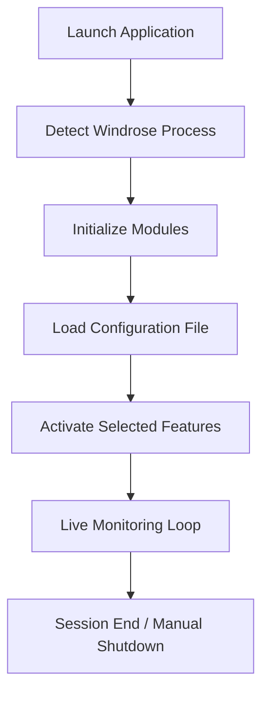

# Windrose Cheat Menu Software

Windrose Cheat Menu Software is a dedicated runtime control application engineered for structured in-game parameter manipulation within **Windrose** environments. Built for Windows platforms, it provides controlled access to gameplay variables through a modular interface designed for clarity, speed, and precision.

This software focuses on structured execution, transparent configuration logic, and controlled activation layers rather than chaotic toggling. Every feature is categorized, adjustable, and logged for stable operation.

---

## 🔧 System Architecture Overview

Windrose Cheat Menu Software operates as a layered injection-based control system:

1. Environment detection
2. Session binding
3. Module initialization
4. Live configuration mapping
5. Runtime execution loop

This structured approach ensures controlled behavior without unnecessary background processes.

---

## ⚙ Core Control Modules

Windrose Cheat Menu Software separates its functionality into precision modules:

### • Parameter Override Layer

Direct variable editing for:

* Resource values
* Movement modifiers
* Cooldown adjustments
* Damage scaling

### • Visual Overlay System

* Real-time spatial awareness
* Object highlight mapping
* Distance indicators
* Configurable opacity control

### • Automation Engine

* Conditional triggers
* Scripted input mapping
* Timed execution sequences

### • Stability Monitor

* Process heartbeat detection
* Auto-recovery binding
* Memory integrity checks

[!IMPORTANT]
All modules operate independently. You can activate single components without initializing the full system stack.

---

## 🧩 Customization Depth

Windrose Cheat Menu Software provides granular configuration through a structured JSON-based control file.

Example configuration snippet:

```json
{
  "movement_multiplier": 1.35,
  "resource_lock": true,
  "overlay_opacity": 0.65,
  "auto_trigger_delay": 120
}
```

Each variable is mapped through a runtime-safe handler. Values outside acceptable ranges are rejected automatically.

You can bind menu activation to custom hotkeys and configure toggles via the integrated interface panel.

---

## 🚀 Installation & Runtime Setup

### Step 1 — Extract

Unpack the distribution package into a secure local directory.

### Step 2 — Launch Controller

Run the executable with standard user privileges.

### Step 3 — Bind to Windrose

Open Windrose and allow the system to detect the active session.

### Step 4 — Activate Modules

Enable required modules through the control panel.

---

## 🔄 Runtime Workflow Diagram



The workflow ensures structured activation, continuous monitoring, and controlled shutdown procedures.

---

## 🔐 Safety & Control Mechanisms

Windrose Cheat Menu Software includes layered execution checks:

* Memory offset validation
* Version mismatch detection
* Auto-disable on instability
* Config rollback capability

[!WARNING]
If Windrose updates its core engine, re-scan the environment before enabling advanced modules.

---

## 💡 Operational Advantages

* Fast initialization (< 3 seconds typical load)
* Modular toggling without restart
* Persistent configuration profiles
* Minimal CPU footprint
* Structured parameter logging

Designed for performance stability rather than cluttered feature stacking.

---

## ❓ Frequently Asked Questions

### Does the software modify core Windrose files?

No. It operates through runtime memory mapping and does not rewrite installation data.

### Can modules be used independently?

Yes. Each module is isolated and can run without activating others.

### Is configuration required before first launch?

Default presets load automatically, but manual tuning is recommended for advanced usage.

### Does it support keyboard-only navigation?

Yes. Full keyboard control is integrated, including hotkey rebinding.

---

## 📦 Closing Summary

Windrose Cheat Menu Software is a structured runtime control tool built for Windows systems requiring controlled parameter management, overlay intelligence, and automation mapping within Windrose environments.

Its modular engine, safety layers, and customization depth make it suitable for controlled deployment scenarios where precision matters.

Explore structured configuration.
Access controlled execution.
Deploy with confidence.

---
